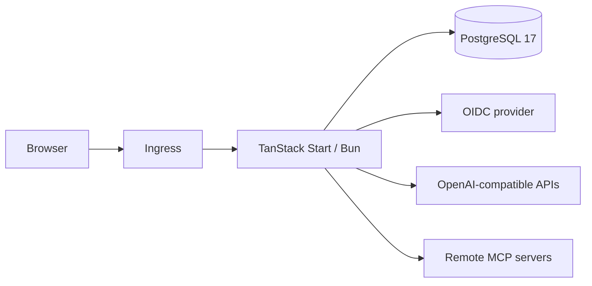

AI Chat is one TanStack Start deployment backed by PostgreSQL. The browser, API routes, authentication handler, and streaming endpoint share the same Bun process. Application pods are stateless.

## Request boundary

The application serves:

- sign-in and first-boot pages;
- authenticated chat and settings pages;
- Better Auth routes;
- administrator APIs;
- provider and MCP configuration APIs;
- the streaming chat endpoint;
- health and public-branding endpoints.

Every user-owned database query includes the authenticated user ID.

## Data model

PostgreSQL stores:

- users, accounts, sessions, and verification records;
- singleton installation, OIDC, and branding configuration;
- user-owned providers and models;
- user-owned MCP servers and trusted tool fingerprints;
- chats and per-chat MCP selections;
- ordered message UI parts and metadata;
- audit events.

## First boot

Setup takes a PostgreSQL advisory transaction lock and installation-row lock. Inside that serialized transaction it verifies the installation is unclaimed, creates the first local user, assigns the administrator role, and closes setup.

## Chat generation

1. Authenticate the caller and load the owned chat.
2. Load canonical ordered messages from PostgreSQL.
3. Validate the selected user-owned model and provider.
4. Connect request-scoped clients for selected, trusted MCP servers.
5. Save the user turn.
6. Stream model UI parts and bounded automatic tool execution.
7. Persist the finalized or interrupted assistant turn.
8. Close every MCP client on completion, abort, or error.

## Secrets

The chart supplies authentication, encryption, setup, and database secrets. At runtime, OIDC client secrets, provider keys and headers, and MCP headers are stored as versioned AES-256-GCM envelopes.

## Kubernetes resources

The chart can create:

- application Deployment and Service;
- migration init container;
- optional Traefik-compatible Ingress;
- ConfigMap and optional chart-managed Secret;
- optional PostgreSQL StatefulSet, headless Service, and RWO PVC;
- application NetworkPolicy.

The application container runs non-root with dropped capabilities and a read-only root filesystem. A complete `emptyDir` is mounted at `/tmp`.
